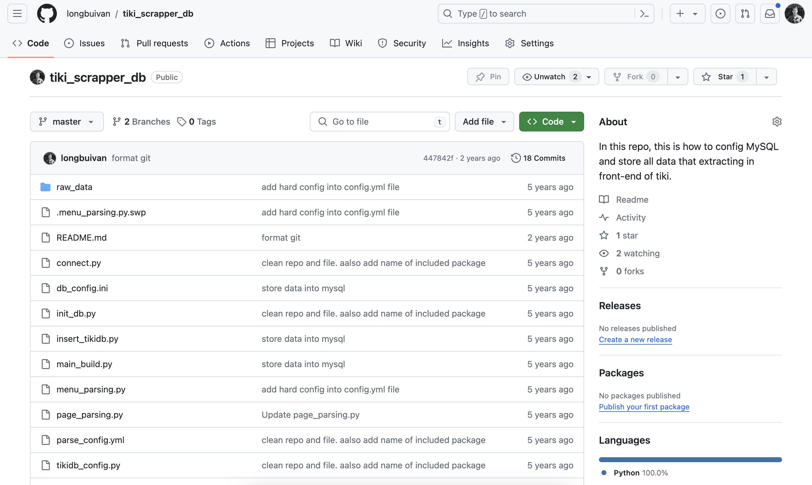

# Description

This example of ETL pipeline, it is trying to store data that extracting in front-end into MySQL Database.

## Technique

- Python3
- Lib: BeautifulSoup, urllib, pandas, pyyml
`pip3 install requirements.txt`

- Install virtual environment

```shell
  python3 -m venv demo
```

- Database: Mysql
  - Install Mysql, MysqlConnector or Using Docker Container

```shell
  docker pull mysql
  docker run --name mysql_container -e MYSQL_ROOT_PASSWORD="RootAccount123" -d mysql
  docker ps
```

- Database Management: phpMyadmin / Dbeaver
  - Install phpmyadmin package for further manage databases
  - Use default local IP and root user to login.
- Environment: Any
- Editor: Any

## Workflow

- Extract category in the menu, an output is list of url (Subcategory)
- Using each input as parameter for page_parsing, which is parsing data of every products on fixed number page (customable)
- Store raw data into MySQL

## Start the Pipeline

- Start the Python venv `(demo)`

```shell
source demo/bin/activate
```

- Start the `main_build.py` file

```shell
python3 main_build.py
```

## Next step

- clean raw data for useable
- create pipeline for scheduling run
- apply model, analysis


## Changelog

-  [v1.0 Init Version - 2019]()
-  [v2.0 Refactor Version - 2024]()
-  
